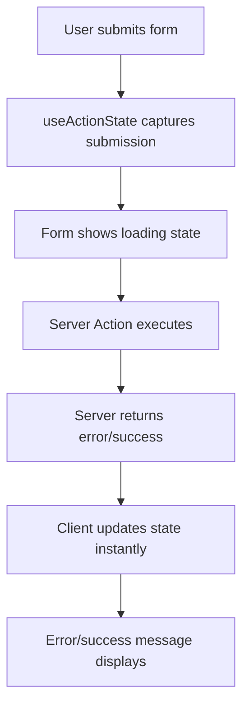
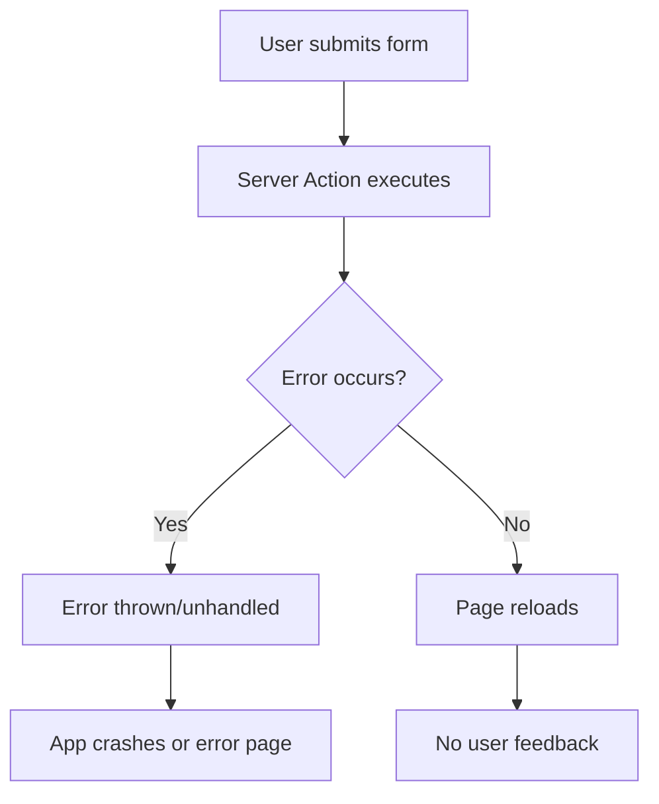

# Technical Deep Dive: Server Actions Error Handling

## 🤔 Why Does the Form Need to be a Client Component?

### The Fundamental Reason: React Hooks

```tsx
// ❌ This CANNOT work in a Server Component
export default function ServerComponentForm() {
  // Error: React hooks can only be used in Client Components
  const [state, formAction] = useActionState(addUser, {});

  return <form action={formAction}>...</form>;
}
```

**Server Components run on the server during the build/request time. They cannot:**

- Use React hooks (`useState`, `useEffect`, `useActionState`, etc.)
- Handle browser events (clicks, form submissions with state)
- Maintain client-side state
- Re-render based on user interactions

### What Happens During Form Submission?

#### With Client Component (Our Approach):



#### With Server Component Only:



## 🔍 Detailed Comparison of Approaches

### 1. Our Client Component Approach (`useActionState`)

**Code Structure:**

```tsx
"use client";
import { useActionState } from "react";

export default function Form() {
  const [state, formAction] = useActionState(serverAction, initialState);

  return (
    <form action={formAction}>
      {state.error && <ErrorDisplay error={state.error} />}
      {state.success && <SuccessMessage />}
      <input name="email" />
      <SubmitButton />
    </form>
  );
}
```

**Server Action:**

```tsx
type FormState = { error?: string; success?: boolean };

export async function serverAction(prevState: FormState, formData: FormData): Promise<FormState> {
  try {
    // API call
    return { success: true };
  } catch (error) {
    return { error: "Something went wrong" };
  }
}
```

**Pros:**

- ✅ Immediate error feedback
- ✅ Loading states
- ✅ No page refresh
- ✅ Type-safe error handling
- ✅ Progressive enhancement
- ✅ Excellent UX

**Cons:**

- ⚠️ Requires client component
- ⚠️ Slightly more JavaScript bundle size

### 2. Server Component with URL Search Params

**Code Structure:**

```tsx
// Server Component
export default function Form({ searchParams }) {
  return (
    <div>
      {searchParams.error && <div className="error">{searchParams.error}</div>}
      <form action={serverActionWithRedirect}>
        <input name="email" />
        <button type="submit">Submit</button>
      </form>
    </div>
  );
}
```

**Server Action:**

```tsx
import { redirect } from "next/navigation";

export async function serverActionWithRedirect(formData: FormData) {
  try {
    // API call
    redirect("/?success=true");
  } catch (error) {
    redirect(`/?error=${encodeURIComponent(error.message)}`);
  }
}
```

**Pros:**

- ✅ No client JavaScript required
- ✅ Works with Server Components

**Cons:**

- ❌ Page refresh required
- ❌ Error state visible in URL
- ❌ No loading states
- ❌ Poor UX (full page reload)
- ❌ URL can become messy
- ❌ SEO implications (error URLs)

### 3. Server Component with Cookies

**Code Structure:**

```tsx
import { cookies } from "next/headers";

export default function Form() {
  const cookieStore = cookies();
  const error = cookieStore.get("form-error")?.value;
  const success = cookieStore.get("form-success")?.value;

  return (
    <div>
      {error && <div className="error">{error}</div>}
      {success && <div className="success">Success!</div>}
      <form action={serverActionWithCookies}>
        <input name="email" />
        <button type="submit">Submit</button>
      </form>
    </div>
  );
}
```

**Server Action:**

```tsx
import { cookies } from "next/headers";
import { redirect } from "next/navigation";

export async function serverActionWithCookies(formData: FormData) {
  try {
    // API call
    cookies().set("form-success", "User created successfully");
    cookies().delete("form-error");
  } catch (error) {
    cookies().set("form-error", error.message);
    cookies().delete("form-success");
  }
  redirect("/");
}
```

**Pros:**

- ✅ Works with Server Components
- ✅ No error state in URL

**Cons:**

- ❌ Complex cookie management
- ❌ Still requires page refresh
- ❌ Cookie size limitations (4KB)
- ❌ Need to manually clean up cookies
- ❌ No loading states
- ❌ Debugging complexity

### 4. Traditional Server Component (Your Original)

**Code Structure:**

```tsx
export default function Form() {
  return (
    <form action={basicServerAction}>
      <input name="email" />
      <button type="submit">Submit</button>
    </form>
  );
}
```

**Server Action:**

```tsx
export async function basicServerAction(formData: FormData) {
  try {
    // API call
  } catch (error) {
    throw new Error("Failed to add user"); // ❌ This crashes the app!
  }
}
```

**Pros:**

- ✅ Simple implementation
- ✅ No client JavaScript

**Cons:**

- ❌ Unhandled errors crash the app
- ❌ No user feedback
- ❌ No error recovery
- ❌ Poor debugging experience

## 🎯 Why Our Approach is Best Practice

### 1. User Experience First

```tsx
// Users immediately see what's happening
{
  pending && <div>Loading...</div>;
}
{
  state.error && <div className="error">{state.error}</div>;
}
{
  state.success && <div className="success">Success!</div>;
}
```

### 2. Error Recovery

```tsx
// Users can immediately try again without page refresh
<form action={formAction}>{/* Error shown, form still functional */}</form>
```

### 3. Type Safety

```tsx
// Full TypeScript support prevents runtime errors
type FormState = {
  error?: string;
  success?: boolean;
  data?: UserData;
};
```

### 4. Progressive Enhancement

```tsx
// Works even if JavaScript fails to load
<form action={formAction}>
  {" "}
  {/* Still submits without JS */}
  <noscript>
    <div>JavaScript is disabled but form still works!</div>
  </noscript>
</form>
```

## 🚀 Performance Considerations

### Bundle Size Impact

```bash
# Our approach adds minimal overhead:
useActionState: ~2KB gzipped
Form validation: ~1KB gzipped
Error handling: ~500B gzipped
Total: ~3.5KB additional JavaScript
```

### Server vs Client Rendering

```tsx
// Server Component: Rendered once on server
export default function UserList() {
  return <div>{users.map(user => ...)}</div>; // Fast, SEO-friendly
}

// Client Component: Interactive, state management
export default function Form() {
  const [state, action] = useActionState(...); // Rich UX, real-time feedback
  return <form action={action}>...</form>;
}
```

## 🔧 Best Practices Summary

1. **Use Client Components for forms with error handling**
2. **Keep Server Components for data display**
3. **Always return structured data from Server Actions**
4. **Provide loading states for better UX**
5. **Handle both network and application errors**
6. **Use TypeScript for type safety**
7. **Implement progressive enhancement**

## 🎓 Learning Resources

- [React 18 useActionState Documentation](https://react.dev/reference/react/useActionState)
- [Next.js Server Actions Best Practices](https://nextjs.org/docs/app/building-your-application/data-fetching/server-actions-and-mutations)
- [Form Validation with Server Actions](https://nextjs.org/docs/app/building-your-application/data-fetching/server-actions-and-mutations#validation)
